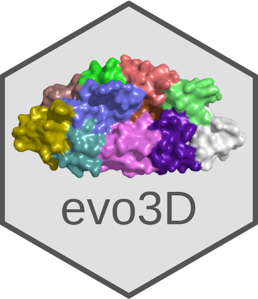
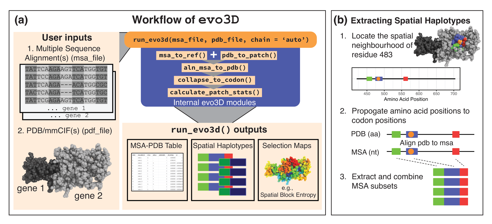
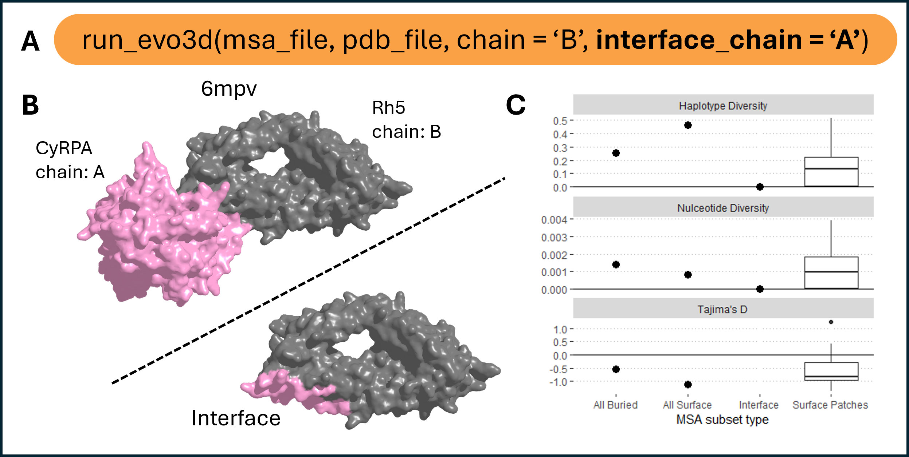
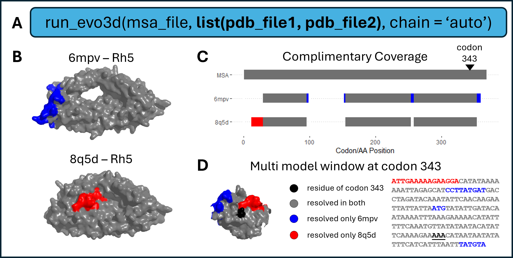
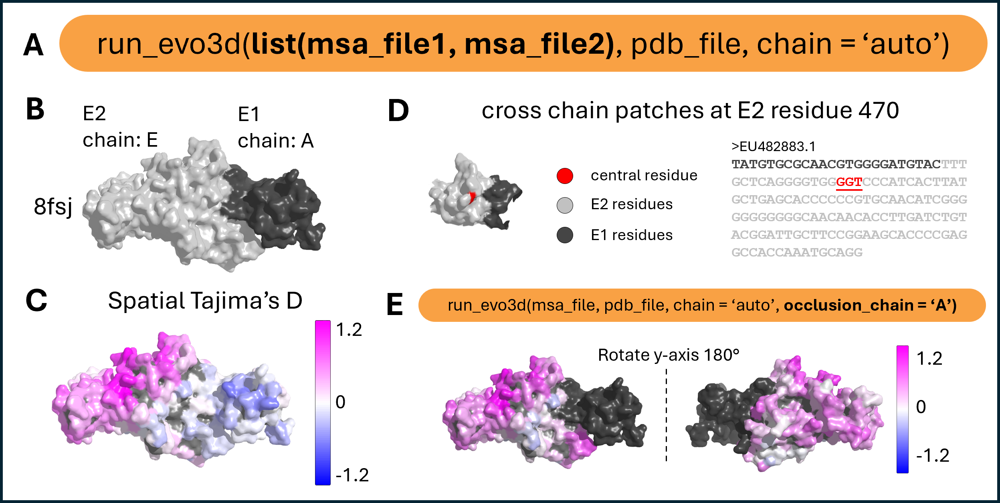

#   Tutorials for evo3D
---

This site contains coding tutorials and visual examples demonstrating how to use the evo3D R package. The tutorials provide step-by-step workflows, while the figures below give quick overviews of common evo3D analyses and outputs.

## Package install instructions
You can find package install instructions at:

https://github.com/bbroyle/evo3D

---

## Coding tutorials

- [Tutorial 1: Getting Started](docs/tutorial1_getting_started.html)
- [Tutorial 2: Tuning Parameters](docs/tutorial2_tuning_parameters.html)
  
---

## run_evo3d() overview

evo3D workflow and spatial haplotype extraction. 

(A) Inputs are a multiple sequence alignment (MSA) (nucleotide or amino acid) and a PDB/mmCIF structure (single chain or complex). In the example of user inputs, two gene MSA’s correspond to one protein complex. run_evo3d() automatically maps structure chains to MSAs, defines 3D neighborhoods (patches), aligns the PDB sequence to the MSA, and computes spatial haplotype statistics. Outputs include an MSA-PDB mapping table, spatial haplotypes (MSA subsets) (optionally written to file), and selection maps projected onto the structure. (B) Spatial haplotypes are constructed by (1) defining a 3D neighborhood around a centroid residue (tunable parameters control neighborhood definition); (2) propagating residue positions to codon positions via the PDB→MSA map; and (3) extracting and concatenating those MSA columns to generate spatial haplotypes. Abbreviations: aa, amino acid; nt, nucleotide.

## capturing interfaces as spatial hapltoypes
   

Protein binding interface integration. 

(A) run_evo3d() supports protein–protein binding interfaces as additional patches alongside full surface patch analysis using the interface_chain argument. Users may specify one or more chains, or set to 'all’ to include all available interfaces.(B) Example of the Rh5–CyRPA complex (PDB: 6mpv, chains B and A, respectively), with interface residues on Rh5 highlighted. Interfaces are, by default, identified as surface-exposed residues within 4 Å of a partner chain. (C) Summary statistics for haplotype diversity, nucleotide diversity, and Tajima’s D across four residue groups: all buried residues, all surface residues, Rh5-CyRPA interface residues, and 3D surface patches.

## using multiple structure models to extend MSA coverage
  

Multi-model structural integration. 

(A) run_evo3d() supports lists of structure files to integrate complementary coverage across multiple models. (B) Example structures of Rh5 (PDB: 6mpv and 8q5d) with uniquely resolved regions shown in blue (6mpv) and red (8q5d). (C) Summary of structure-to-MSA alignment coverage. Gray bars at structure model rows indicate residues resolved in both structures, while blue and red indicate residues uniquely resolved in one or the other. (D) Example of a multi-model patch centered at the residue encoded by codon 343, visualized on the combined 3D patch and patch-level MSA subset.

## using multiple MSA for protein complexes

Multi-chain patch analysis and occlusion handling. 

(A) run_evo3d() supports multi-chain complexes by accepting multiple MSAs. MSA entries must share identical FASTA headers to ensure correct pairing across chains. Chain assignment can be automatic using chain = 'auto’, or specified matching the order of MSA inputs – c("A", "E"). (B) Structural model of the E1–E2 envelope protein complex (PDB: 8fsj), with chain E2 in light gray and E1 in dark gray. (C) Tajima’s D values mapped across the full protein surface. run_evo3d() treats the complex as a continuous surface, allowing patches to span across chain boundaries. (D) Example of a multi-chain patch centered at residue 470 of E2, with residues from both chains shown on the 3D patch and in the corresponding patch-level MSA subsets. (E) The occlusion_chain argument enables structurally adjacent chains to be included in solvent accessibility calculations while excluding their sequences from patch extraction or selection analysis. Users may specify one or more chains, or set to 'all' to include all chains except the one under analysis. The structure is rotated to show the full molecular surface. 
