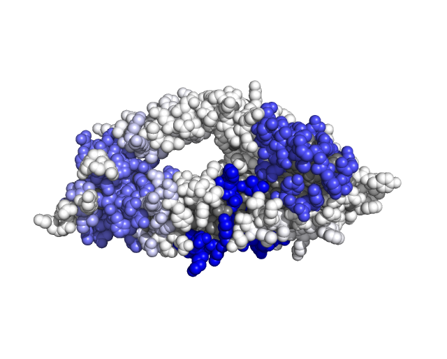

evo3D links multiple sequence alignments MSAs (nucleotide or protein) to PDB/mmCIF structures enabling calculation of statistics on three-dimensional windows (“spatial haplotypes”).

This tutorial covers two examples. The first introduces the minimum required inputs, demonstrates how to run evo3D, and explains how to interpret the core output table (`results$evo3d_df`). The second example adds statistics, and demonstrates how to write and visualize outputs in PyMol.

**Assumptions**

-   Nucleotide MSAs must be in-frame and intron-free
-   Examples below assume evo3D is already installed (see <https://github.com/bbroyle/evo3D> for installation instructions)

## Example 1 (Quick start)

The package includes several tutorial datasets to help users become familiar with the evo3D workflow. This first example provides a minimal end-to-end run.

```{r}
msa_path <- system.file("extdata", "rh5_pfalc.fasta", package = "evo3D")
pdb_path <- system.file("extdata", "rh5_6mpv_AB.pdb", package = "evo3D")

# These are examples shipped with the package - your paths may resemble #
# msa_path <- 'myfolder/sequences.fasta'
# pdb_path <- 'myfolder/structure.pdb'
```

### Run evo3D (defualts)

By default, evo3D constructs surface windows consisting of a central residue and all neighboring surface residues (relative solvent accessibility \>= 0.1) within 15 Å.

```{r}
library(evo3D)

results <- run_evo3d(msa = msa_path, 
                     pdb = pdb_path,
                     verbose = 0)  # turning off progress printing #
```

`run_evo3d()` is a high-level wrapper that coordinates the full evo3D workflow: reference sequence construction, spatial window generation, MSA↔structure alignment, and (optionally) statistic calculation.

### Structure of evo3D results

```{r}
str(results, max.level = 1)
```

The output of `run_evo3d()` is always a six-element list. The primary result is `results$evo3d_df`, a table that records the MSA↔PDB mapping, the spatial window associated with each codon, and any calculated statistics. The remaining elements store additional information about the input data, transformations, and run parameters. They will be covered in detail a later tutorial.

### Structure of evo3d_df

Every codon position in the input MSA(s) is represented as a row in `evo3d_df`. Some codons may not map to a residue in the PDB structure (for example, due to unresolved residues in the structure). In these cases, no spatial window is assigned, and the codon is not included in any other spatial windows. These rows will contain `NA` values for window-related fields and statistics.

```{r}
results$evo3d_df[29:31,]
```

A brief explanation of columns:

| Column | Description |
|----|----|
| codon_id | Unique identifier combining `codon` index and `msa` source. |
| codon | codon position in input MSA (indexing starts at 1) |
| msa | Source MSA identifier (useful when analyzing complexes with multiple MSAs). |
| pdb | Source structure identifier (useful when multiple PDBs are provided). |
| residue_id | Unique structural residue identifier (residue index \_ chain \_ insertion code). |
| ref_aa | Amino acid sequence derived from a constructed MSA reference sequence. Used for alignment to the PDB sequence. |
| pdb_aa | Amino acid sequence(s) in PDB file. |
| codon_patch | spatial neighborhood recorded as codon_id(s), separated by `+` |
| codon_len | Number of structural residues included in the spatial window. |
| unique_codon | Number of unique codons underlying those residues (can differ from `codon_len` in homomultimers). |
| gap_map_count | Number of residues present in the structure-derived windows but aligned to MSA gaps; excluded from final windows. |
| exposed | Logical flag indicating whether the residue passed exposure filtering. |
| max_dist | Maximum distance (Å) between the central residue and any included neighbor. |
| msa_subset_id | Key identifying the spatial haplotype subset in `final_msa_subsets` (retained when `detail_level = 2`). |

## Example 2 (Adding statistics)

Using the same input data, we now enable calculation of:

-   per-codon statistic (amino acid site_entropy)

-   averaging of per-codon statistic within spatial windows (avg_patch_entropy)

-   patch-level haplotype statistic (amino acid block_entropy)

We will also leave `verbose` as default `1` to see the internal workflow orgnization

```{r}
library(evo3D)

msa_path <- system.file("extdata", "rh5_pfalc.fasta", package = "evo3D")
pdb_path <- system.file("extdata", "rh5_6mpv_AB.pdb", package = "evo3D")

results <- run_evo3d(msa = msa_path, pdb = pdb_path, 
                     stat_controls = list(calc_site_entropy = TRUE,
                                          calc_avg_patch_entropy = TRUE,
                                          calc_block_entropy = TRUE))
```

Returning to `evo3d_df` we will see it populated with the calculated statistics.

```{r}
results$evo3d_df[50:54,]

```

### Writing results to PyMol for visualization

Finally, we export block entropy and site entropy values to a PDB file for visualization in PyMol. The `stat_name` argument accepts up to two columns from `evo3d_df`, and writes them to the B-factor and occupancy fields (or just to B-factor if only one column name is provided).

```{r}
write_stat_to_pdb(results, 
                  stat_name = c('block_entropy', 'site_entropy'),
                  outfile = '~/evo3D_tutorials/results/tutorial1_rh5.pdb')
```

In PyMol, both the B-factor (`b`) and occupancy (`q`) fields can be used to visualize mapped statistics on the protein structure. By default, evo3D writes missing values (`NA`) as `-99` in the output PDB file and should be excluded from visualization.

The following commands illustrate a simple visualization workflow in PyMol:\
\
color grey\
select stat1, b \> -99\
select stat2, q \> -99\
\
spectrum b, white blue, selection=b\
spectrum q, selection=stat2\
\
Below, block entropy is shown mapped to the B-factor column

{width="526"}

## Next tutorials:

2.  Tuning parameters

3.  Protein complexes

4.  Results object in detail

5.  Custom statistics
