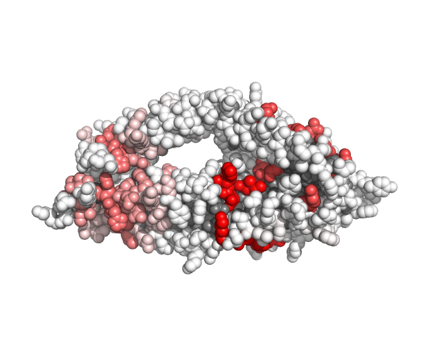

In this tutorial we will see how to tune spatial window (patch) parameters. There are many types of 3D windows (window modes): fixed distance verses fixed count, surface-filtered versus unrestricted.

## Example 1 (Fixed count patches compared to fixed distance)

We will reuse the prepacked data from Tutorial 1. This time running evo3D twice: once as fixed count (15 codons) and once as fixed distance of 10 Å.

```{r}
msa_path <- system.file("extdata", "rh5_pfalc.fasta", package = "evo3D")
pdb_path <- system.file("extdata", "rh5_6mpv_AB.pdb", package = "evo3D")
```

## Specifying patches parameters (pdb_controls)

The evo3D workflow is tuned through control lists passed to each module.

```{r}
library(evo3D)

# add some stats #
sc <- list(calc_block_entropy = TRUE)

# customize type of window #
# these two control either fixed count, or fixed distance #
# they can be combined as in nearest fixed count as long as distance isn't exceeded
pc1 <- list(max_patch = 15, dist_cutoff = NA)
pc2 <- list(max_patch = NA, dist_cutoff = 10)

results1 <- run_evo3d(msa_path, pdb_path,  # msa and pdb can be positional arguments #
                     stat_controls = sc, 
                     pdb_controls = pc1,
                     verbose = 0)

results2 <- run_evo3d(msa_path, pdb_path,
                      stat_controls = sc,
                      pdb_controls = pc2,
                      verbose = 0)
```

### Comparing the results of two window types

```{r}
fixed_count <- results1$evo3d_df
fixed_dist <- results2$evo3d_df

# Fixed count is always 15 codons, while fixed distance varies #
summary(fixed_count$codon_len)
```

```{r}
summary(fixed_dist$codon_len)
```

```{r}
# And of course Fixed distance stays within a maximum distance, while 
# fixed count can exceed. As mentioned above both window modes may be used simultaneously.
summary(fixed_count$max_dist)
```

```{r}
summary(fixed_dist$max_dist)
```

```{r}
hist(fixed_count$block_entropy - fixed_dist$block_entropy)
```

In this example the spatial windows about a codon did not vary much in terms of block entropy when comparing fixed count to fixed distance. The example Rh5 MSA here has very few polymorphic sites, so often windows where unaffected by inclusion or deletion of a few neighbors, however other MSA↔PDB pairings would have much larger effects.\
\
These two window modes serve different purposes: haplotype statistics likely are better suited to fixed count windows, while averaging per-codon statistics in spatial windows would apply to either window mode. Some analysis, like scanning a surface in antibody-binding-site sized windows, maybe better suited to fixed distance than fixed count. In previous 3D evolutionary analysis, 3D windows were of fixed distance, evo3D implements fixed count also as an advantageous approach when comparing haplotype statistics across windows.

### Adding new data to evo3d_df

```{r}
# creating an additional stat column in evo3d_df #
fixed_count$diff <- fixed_count$block_entropy - fixed_dist$block_entropy

# replace evo3d_df with this modified table #
results1$evo3d_df <- fixed_count

# write this new stat to PDB file #
write_stat_to_pdb(results1, stat_name = 'diff', outfile = '~/evo3D_tutorials/results/block_entropy_diff.pdb')
```

The above workflow of adding secondary statistics to `evo3d_df`, is especially useful for customized workflows and statistics. Let evo3D handle the MSA↔PDB mapping; users are free to define and apply statistics on spatial haplotypes or individual codon positions. Then by adding new columns to `evo3d_df` these are easily turned into visualizations.\
\
Block Entropy differences (Larger difference = Darker Red)

{width="549"}

## Other Adjustable Parameters

`show_evo3d_defaults()` is a useful function to explore the tunable parameters. With no arguments the parameters of all control lists are shown but can be individually called for `msa` `pdb` `aln` `stat` `output` and `collapse`. An explanation of each option and allowed inputs is available in the supplementary table accompanying the evo3D paper.

```{r}
show_evo3d_defaults('pdb')
```

Below is the full tunable parameter set. Worth highlighting are:\
`msa_controls$ref_method` which can also be set to "least_gap" or a row number\
`aln_controls$use_sample_names` which is TRUE/FALSE and when true only constructs cross-gene spatial haplotypes when sample names match. This applies when studying protein complexes\
`collapse_controls$merge_type` which controls how multiple windows per codon are merged into single spatial windows. This applies when studying homomultimer complexes, or including multiple PDB models. Additionally, `analysis_mode` in `run_evo3d()` must be set to `codon` for codon collapsing of windows to take place, otherwise every residue from PDB files will have a row in `evo3d_df`.

```{r}
show_evo3d_defaults()
```

## Next tutorials:

3.  Protein complexes
4.  Results object in detail
5.  Custom statistics
