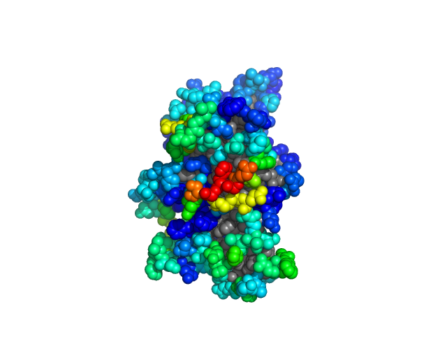
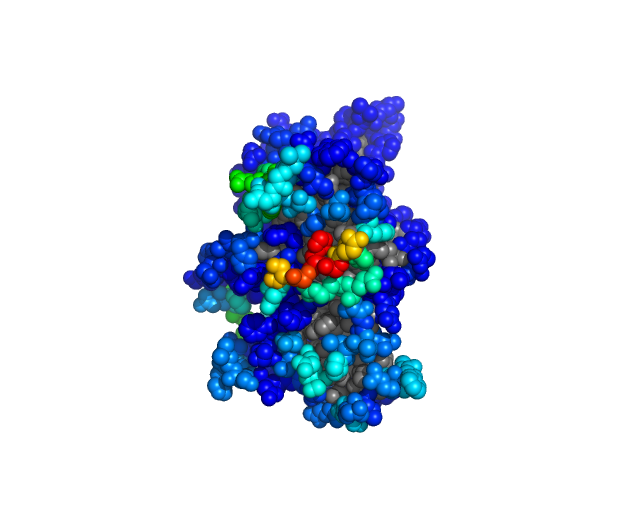

Here we will show the power of returning spatial haplotypes, and codon_indexed windows, which allows users to apply their own desired statistics on spatial derived windows. First lets have evo3D handle the MSA to PDB mapping for us. In example 1, we will add (synthetic) per codon stats to `evo3d_df` results table and summarize these stats in spatial windows. In example 2, we will add amino acid ....

```{r}
library(evo3D)

e2 <- system.file("extdata", "e2_hepc_sorted.aln", package = "evo3D")
pdb <- system.file("extdata", "e1e2_8fsj.pdb", package = "evo3D")

results <- run_evo3d(e2, pdb,
                     pdb_controls = list(max_patch = 5),
                     detail_level = 2)

# spatial haplotypes can be written to file #
# write_patch_fastas(results$final_msa_subsets, output_dir = '...')

# this can be accomplished inside the wrapper regardless of detail_level #

#run_evo3d(e2, pdb, detail_level = -1, 
#          output_controls = list(output_dir = 'e2_run'))
```

## Example 1 (window summaries of per-codon stats)

This setup can be applied when dn/ds or other statistics have been calculated for the MSA outside of evo3D. Tracking the codon positions it is easy to add and summarize a per-codon statistic within the constructed spatial windows.

```{r}
# we can imagine some dn/ds data #
omega <- runif(nrow(results$evo3d_df), min = 0, max = 2)

# of course this data is just synthesized but the following workflow will be useful #
omega_df <- data.frame(codon = 1:nrow(results$evo3d_df), estimate = omega)

head(omega_df)
```

In a table such as this, where per-codon stats have been calculated for the msa. It will be easy to add to evo3d_df.

```{r}
# it is best to assign to codons as gaps may have been introduced to reference sequence when aligning to PDB sequences #
df <- results$evo3d_df

df$omega <- omega_df$estimate[match(df$codon, omega_df$codon)]
```

### Using summarize_stat_at_patch() to do spatial summaries

```{r}
# with a new stat column and the original codon_patch column in place #
# we can summarize a per-codon statistic over spatial windows #
df = summarize_stat_at_patch(df, stat_col = 'omega', method = 'mean')

# now we have added a new column #
# "method_statcol"
df$mean_omega[40:50]
```

```{r}
# we could also find median or other summaries #
df = summarize_stat_at_patch(df, stat_col = 'omega', method = 'median')

df$median_omega[40:50]
```

Now we have added two downstream statistics. One finding average dn/ds (synthetic data) in a spatial window. The other finding a median of the synthetic dn/ds data. These stats can now be visualized with PyMol.

```{r}
# Add df back to evo3d_results object
results$evo3d_df = df

# and use write_stat_to_pdb()
write_stat_to_pdb(results, stat_name = c("mean_omega"), outfile = "~/evo3D_tutorials/results/e2_synthetic_dnds.pdb")

```

We will skip visualization - its made up data. See tutorial 1 - for pymol coloring tips

## Example 2 - adding haplotype based statistics

```{r}

# using the msa subsets provided by evo3D
msa_subsets = results$final_msa_subsets
df = results$evo3d_df

# we can see the number of unique haplotypes per patch #
unique_haplotypes = sapply(msa_subsets, function(x){
  # stored as a matrix we will need sequences #
  seqs = apply(x, 1, paste0, collapse = '')
  length(unique(seqs))
})

# add a column to evo3d_df -- safest to match by names of msa_subsets #
df$n_haplotypes = unique_haplotypes[match(df$msa_subset_id, names(unique_haplotypes))]

summary(df$n_haplotypes)
```

```{r}
# we will repeat the above but do it at the amino acid level #
unique_aa_haplotypes = sapply(msa_subsets, function(x){
  # translate and build sequences #
  seqs = apply(x, 1, function(y){
    y = seqinr::translate(y)
    paste0(y, collapse = '')
  })
  
  length(unique(seqs))
})

# add a column to evo3d_df -- safest to match by names of msa_subsets #
df$n_aa_haplotypes = unique_aa_haplotypes[match(df$msa_subset_id, names(unique_aa_haplotypes))]

summary(df$n_aa_haplotypes)
```

A general suggestion: when adding per codon statistics it is safer to match by codon as we did in example 1. The same goes for adding haplotype based statistics from msa_subsets, it is safer to match by the name of the msa_subset as many rows may not have a spatial window (buried or unresolved).

```{r}
#| warning: false
library(ggplot2)

ggplot(df, aes(n_haplotypes, n_aa_haplotypes))+
  geom_point()+geom_abline(slope = 1)+
  ggtitle('Comparing nuc to aa haplotype counts\nin 5 codon spatial windows')+
  theme_bw(base_size = 18)
```

Again refer to tutorial 1 for pymol tips

```{r}
# Add df back to evo3d_results object
results$evo3d_df = df

# and use write_stat_to_pdb()
write_stat_to_pdb(results, stat_name = c("n_haplotypes", 'n_aa_haplotypes'), outfile = "~/evo3D_tutorials/results/e2_n_haplotypes.pdb")
```

Nucleotide Haplotypes ————————————— Amino Acid Haplotypes

## {width="340"}{width="340"}

##   Next tutorials:

... more to come (if you would like any specific please open an issue at github.com/bbroyle/evo3D_tutorials)
